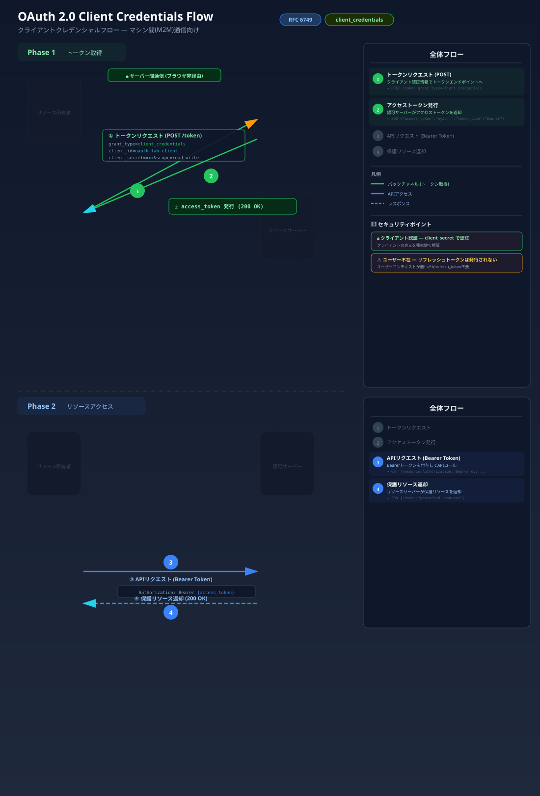

# Client Credentials Flow

## フロー図



## 概要

Client Credentials フローは、**ユーザーが関与しない**サーバー間（Machine-to-Machine）通信で使用されるグラントタイプです（RFC 6749 Section 4.4）。

クライアント自身の認証情報（client_id + client_secret）のみでアクセストークンを取得します。

## ユースケース

- マイクロサービス間の API 通信
- バッチ処理やバックグラウンドジョブ
- 管理用ダッシュボードのバックエンド

## フロー

```
+--------+                               +---------------+
|        |---(1) Token Request----------->|               |
| Client |    (client_id + secret)       | Authorization |
|        |<--(2) Access Token------------|    Server     |
+--------+                               +---------------+
```

## トークンリクエスト

```
POST /token
Content-Type: application/x-www-form-urlencoded

grant_type=client_credentials&
client_id=my-service&
client_secret=my-secret&
scope=admin
```

| パラメータ | 説明 |
|-----------|------|
| grant_type | `client_credentials` を指定 |
| client_id | クライアントの識別子 |
| client_secret | クライアントのシークレット |
| scope | 要求する権限（任意） |

## レスポンス

```json
{
  "access_token": "eyJhbGci...",
  "token_type": "Bearer",
  "expires_in": 3600,
  "scope": "admin"
}
```

> **注意:** このフローではリフレッシュトークンは発行されません。トークンが期限切れになったら、再度 Client Credentials で取得します。

## Authorization Code フローとの違い

| 観点 | Authorization Code | Client Credentials |
|------|-------------------|-------------------|
| ユーザー認証 | あり | なし |
| リダイレクト | あり | なし |
| リフレッシュトークン | あり | なし |
| 用途 | ユーザー操作のあるアプリ | サーバー間通信 |

## 参考 RFC

- [RFC 6749 Section 4.4](https://datatracker.ietf.org/doc/html/rfc6749#section-4.4) - Client Credentials Grant
