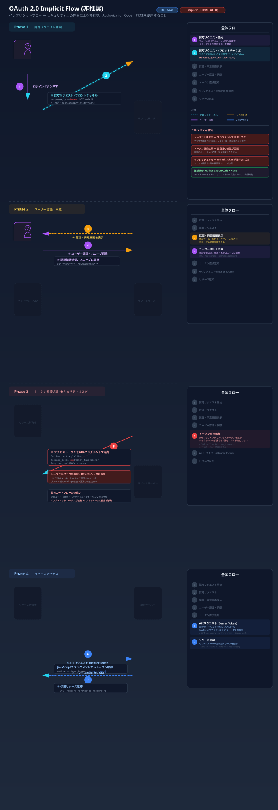

# Implicit Flow（非推奨）

## フロー図



## 概要

Implicit フローは、SPA（Single Page Application）向けに設計されたグラントタイプです（RFC 6749 Section 4.2）。

> **⚠️ 非推奨:** OAuth 2.0 Security BCP および OAuth 2.1 で非推奨とされています。代わりに **Authorization Code + PKCE** を使用してください。

## なぜ非推奨なのか

1. **アクセストークンが URL フラグメントに露出する** — ブラウザ履歴やリファラヘッダから漏洩するリスク
2. **トークン置換攻撃（Token Substitution）** に脆弱
3. **リフレッシュトークンが使えない** — トークン期限切れの度にリダイレクトが必要
4. **送信者制約がない** — トークンを傍受した第三者が利用可能

## フロー（参考）

```
+--------+                               +---------------+
|        |---(1) Authorization Request--->|               |
|  SPA   |    response_type=token        | Authorization |
|        |<--(2) Access Token------------|    Server     |
|        |    (in URL fragment)          |               |
+--------+                               +---------------+
```

### 認可リクエスト

```
GET /authorize?
  response_type=token&
  client_id=spa-client&
  redirect_uri=http://localhost:3000/callback&
  scope=read&
  state=xyz
```

### レスポンス（リダイレクト）

```
HTTP/1.1 302 Found
Location: http://localhost:3000/callback#access_token=eyJhbGci...&token_type=Bearer&expires_in=3600&state=xyz
```

> `#`（フラグメント）で返されるため、サーバーには送信されませんが、JavaScript からアクセス可能です。

## 代替手段: Authorization Code + PKCE

現在の推奨は、SPA でも Authorization Code + PKCE を使用することです。

| 観点 | Implicit | AuthCode + PKCE |
|------|----------|----------------|
| トークンの露出 | URL フラグメント | バックチャネル |
| リフレッシュトークン | 不可 | 可能 |
| PKCE 保護 | なし | あり |
| 現在の推奨 | ❌ 非推奨 | ✅ 推奨 |

## 参考

- [RFC 6749 Section 4.2](https://datatracker.ietf.org/doc/html/rfc6749#section-4.2) - Implicit Grant
- [OAuth 2.0 Security BCP](https://datatracker.ietf.org/doc/html/draft-ietf-oauth-security-topics) - Section 2.1.2
