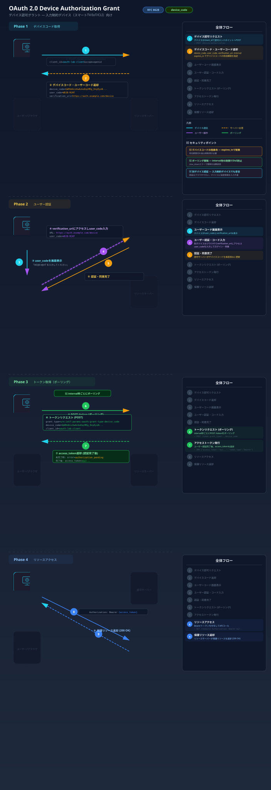

# Device Authorization Grant

## フロー図



## 概要

Device Authorization Grant（RFC 8628）は、**入力機能が制限されたデバイス**（スマートTV、IoTデバイス、CLIツールなど）向けのフローです。

ユーザーはデバイスとは別の端末（スマートフォンやPC）で認可を行います。

## ユースケース

- スマートTV のストリーミングアプリ
- ゲーム機のログイン
- CLI ツール（例: `gh auth login`、`aws sso login`）
- IoT デバイス

## フロー

```
+----------+                                +---------------+
|          |---(1) Device Authorization---->|               |
|  Device  |    Request                    | Authorization |
|          |<--(2) Device Code +-----------|    Server     |
|          |    User Code + URL            |               |
+----------+                                +---------------+
     |
     |  (3) ユーザーにコードと URL を表示
     v
+----------+                                +---------------+
|  User's  |---(4) ブラウザで URL にアクセス->|               |
|  Phone   |    User Code を入力           | Authorization |
|  / PC    |---(5) ユーザー認証 + 同意------>|    Server     |
+----------+                                +---------------+
                                                    |
+----------+                                        |
|          |---(6) Polling (Device Code)----------->|
|  Device  |<--(7) Access Token--------------------|
+----------+
```

## ステップ詳細

### (1) デバイス認可リクエスト

```
POST /device/authorize
Content-Type: application/x-www-form-urlencoded

client_id=device-client&
scope=read
```

### (2) レスポンス

```json
{
  "device_code": "GmRhmhcxhwAzkoEqiMEg_DnyEysNkuNhszIySk9eS",
  "user_code": "WDJB-MJHT",
  "verification_uri": "https://example.com/device",
  "verification_uri_complete": "https://example.com/device?user_code=WDJB-MJHT",
  "expires_in": 1800,
  "interval": 5
}
```

### (3)-(5) ユーザーによる認可

デバイスは画面に以下を表示します:

```
次の URL にアクセスしてコードを入力してください:
  URL:  https://example.com/device
  Code: WDJB-MJHT
```

### (6)-(7) ポーリングによるトークン取得

デバイスは `interval` 秒ごとにトークンエンドポイントをポーリングします:

```
POST /token
Content-Type: application/x-www-form-urlencoded

grant_type=urn:ietf:params:oauth:grant-type:device_code&
device_code=GmRhmhcxhwAzkoEqiMEg_DnyEysNkuNhszIySk9eS&
client_id=device-client
```

ユーザーがまだ認可していない場合:

```json
{
  "error": "authorization_pending"
}
```

認可完了後:

```json
{
  "access_token": "eyJhbGci...",
  "token_type": "Bearer",
  "expires_in": 3600,
  "refresh_token": "dGhpcyBpcyBh..."
}
```

## 参考 RFC

- [RFC 8628](https://datatracker.ietf.org/doc/html/rfc8628) - OAuth 2.0 Device Authorization Grant
